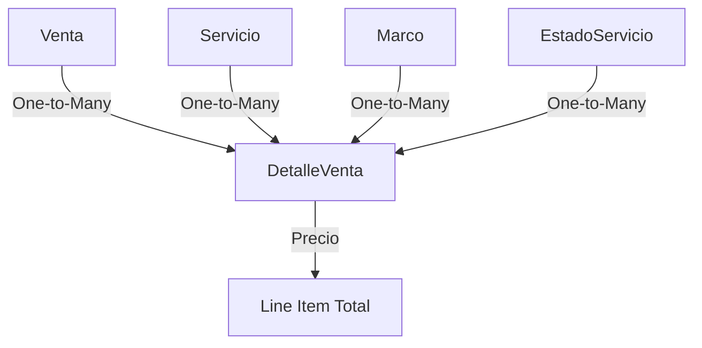

# Detalle Venta API

The **DetalleVenta** entity represents individual line items within a sale transaction. Each detail links a service, optional frame (marco), pricing, and service status to a parent sale (Venta).

## Entity Overview

Sale details track:
- Services provided (eye exams, lens grinding, etc.)
- Optional frame selection
- Individual line item pricing
- Service completion status
- Observations and notes
- Active/inactive state

## Entity Schema

```typescript title="src/models/DetalleVenta.ts" lines
@Entity("detalle_venta")
export class DetalleVenta {
  @PrimaryGeneratedColumn()
  id_detalle!: number;

  @Column({ type: "date" })
  fecha!: Date;

  @Column()
  observacion!: string;

  @Column({ type: "decimal", precision: 10, scale: 2 })
  precio!: number;

  @Column({ type: "boolean" })
  estado!: boolean;

  @ManyToOne(() => Venta, (x) => x.detallesVenta)
  @JoinColumn({ name: "id_venta" })
  venta!: Venta;

  @ManyToOne(() => Servicio, (x) => x.detallesVenta)
  @JoinColumn({ name: "id_servicio" })
  servicio!: Servicio;

  @ManyToOne(() => EstadoServicio, (x) => x.detallesVenta)
  @JoinColumn({ name: "id_estado" })
  estadoServicio!: EstadoServicio;

  @ManyToOne(() => Marco, (x) => x.detallesVenta, { nullable: true })
  @JoinColumn({ name: "id_marco"})
  marco?: Marco;
}
```

### Schema Fields

<ResponseField name="id_detalle" type="number">
  Auto-generated primary key
</ResponseField>

<ResponseField name="fecha" type="Date">
  Service date or completion date
</ResponseField>

<ResponseField name="observacion" type="string">
  Service notes or specifications
</ResponseField>

<ResponseField name="precio" type="number">
  Line item price (decimal with 2 decimal places)
</ResponseField>

<ResponseField name="estado" type="boolean">
  Active status (true = active, false = inactive)
</ResponseField>

<ResponseField name="venta" type="Venta">
  Many-to-one relationship with parent Sale
</ResponseField>

<ResponseField name="servicio" type="Servicio">
  Many-to-one relationship with Service
</ResponseField>

<ResponseField name="estadoServicio" type="EstadoServicio">
  Many-to-one relationship with Service Status
</ResponseField>

<ResponseField name="marco" type="Marco">
  Optional many-to-one relationship with Frame
</ResponseField>

## API Endpoints

### GET /api/detalle-venta

List all sale details with all relations loaded.

**Authentication**: Required (Admin or Empleado role)

**Request**:
```bash
curl -X GET https://api.example.com/api/detalle-venta \
  -H "Authorization: Bearer YOUR_JWT_TOKEN"
```

**Response** (200):
```json
{
  "success": true,
  "data": [
    {
      "id_detalle": 1,
      "fecha": "2024-06-15",
      "observacion": "Single vision lenses, -2.00 both eyes",
      "precio": 125.00,
      "estado": true,
      "venta": {
        "id_venta": 10,
        "fecha": "2024-06-15",
        "total": 300.00
      },
      "servicio": {
        "id_servicio": 2,
        "nombre": "Tallado de Lunas"
      },
      "estadoServicio": {
        "id_estado": 1,
        "nombre": "Pendiente"
      },
      "marco": {
        "id_marco": 5,
        "codigo": "FRAME-005",
        "precio_ensamblado": 45.00
      }
    }
  ]
}
```

<Note>
The GET endpoint automatically loads all relations (venta, servicio, estadoServicio, marco) for complete detail information.
</Note>

### GET /api/detalle-venta/:id

Get a specific sale detail by ID with all relations.

**Authentication**: Required (Admin or Empleado role)

**Request**:
```bash
curl -X GET https://api.example.com/api/detalle-venta/1 \
  -H "Authorization: Bearer YOUR_JWT_TOKEN"
```

**Response** (200):
```json
{
  "success": true,
  "data": {
    "id_detalle": 1,
    "fecha": "2024-06-15",
    "observacion": "Single vision lenses, -2.00 both eyes",
    "precio": 125.00,
    "estado": true,
    "venta": { "id_venta": 10 },
    "servicio": { "id_servicio": 2, "nombre": "Tallado de Lunas" },
    "estadoServicio": { "id_estado": 1, "nombre": "Pendiente" },
    "marco": { "id_marco": 5, "codigo": "FRAME-005" }
  }
}
```

**Error Response** (404):
```json
{
  "success": false,
  "message": "DetalleVenta no encontrado"
}
```

### POST /api/detalle-venta

Create a new sale detail (line item).

**Authentication**: Required (Admin or Empleado role)

**Request**:
```bash
curl -X POST https://api.example.com/api/detalle-venta \
  -H "Content-Type: application/json" \
  -H "Authorization: Bearer YOUR_JWT_TOKEN" \
  -d '{
    "fecha": "2024-06-20",
    "observacion": "Progressive lenses with anti-reflective coating",
    "precio": 185.00,
    "estado": true,
    "id_venta": 10,
    "id_servicio": 2,
    "id_estado": 1,
    "id_marco": 3
  }'
```

**Request Body**:

<ParamField path="fecha" type="string" required>
  Service date in YYYY-MM-DD format
</ParamField>

<ParamField path="observacion" type="string" required>
  Service specifications or notes
</ParamField>

<ParamField path="precio" type="number" required>
  Line item price (e.g., 185.00)
</ParamField>

<ParamField path="estado" type="boolean" default="true">
  Active status (defaults to true)
</ParamField>

<ParamField path="id_venta" type="number">
  ID of the parent sale
</ParamField>

<ParamField path="id_servicio" type="number">
  ID of the service provided
</ParamField>

<ParamField path="id_estado" type="number">
  ID of the service status (EstadoServicio)
</ParamField>

<ParamField path="id_marco" type="number">
  Optional ID of the frame used
</ParamField>

**Response** (201):
```json
{
  "success": true,
  "message": "DetalleVenta creado exitosamente",
  "data": {
    "id_detalle": 5,
    "fecha": "2024-06-20",
    "observacion": "Progressive lenses with anti-reflective coating",
    "precio": 185.00,
    "estado": true
  }
}
```

**Error Responses**:

- **400 Bad Request** - Missing required fields
  ```json
  {
    "success": false,
    "message": "Campos requeridos: fecha, observacion, precio"
  }
  ```

- **404 Not Found** - Invalid foreign key reference
  ```json
  {
    "success": false,
    "message": "Servicio no encontrado"
  }
  ```

### PUT /api/detalle-venta/:id

Update an existing sale detail.

**Authentication**: Required (Admin or Empleado role)

**Request**:
```bash
curl -X PUT https://api.example.com/api/detalle-venta/1 \
  -H "Content-Type: application/json" \
  -H "Authorization: Bearer YOUR_JWT_TOKEN" \
  -d '{
    "precio": 195.00,
    "observacion": "Updated: Progressive lenses with blue light filter",
    "id_estado": 2
  }'
```

**Request Body** (all fields optional):

<ParamField path="fecha" type="string">
  Updated service date
</ParamField>

<ParamField path="observacion" type="string">
  Updated notes
</ParamField>

<ParamField path="precio" type="number">
  Updated price
</ParamField>

<ParamField path="id_venta" type="number">
  Updated parent sale
</ParamField>

<ParamField path="id_servicio" type="number">
  Updated service
</ParamField>

<ParamField path="id_estado" type="number">
  Updated service status
</ParamField>

<ParamField path="id_marco" type="number">
  Updated frame
</ParamField>

**Response** (200):
```json
{
  "success": true,
  "message": "DetalleVenta actualizado",
  "data": {
    "id_detalle": 1,
    "fecha": "2024-06-15",
    "observacion": "Updated: Progressive lenses with blue light filter",
    "precio": 195.00,
    "estado": true
  }
}
```

### DELETE /api/detalle-venta/:id

Delete a sale detail.

**Authentication**: Required (Admin or Empleado role)

<Warning>
Deleting sale details affects the sale's line items and may impact total calculations. Consider using the estado toggle instead.
</Warning>

**Request**:
```bash
curl -X DELETE https://api.example.com/api/detalle-venta/5 \
  -H "Authorization: Bearer YOUR_JWT_TOKEN"
```

**Response** (200):
```json
{
  "success": true,
  "message": "DetalleVenta eliminado"
}
```

### PATCH /api/detalle-venta/:id/toggle-estado

Toggle sale detail active/inactive status.

**Authentication**: Required (Admin or Empleado role)

**Request**:
```bash
curl -X PATCH https://api.example.com/api/detalle-venta/1/toggle-estado \
  -H "Authorization: Bearer YOUR_JWT_TOKEN"
```

**Response** (200):
```json
{
  "success": true,
  "message": "Estado cambiado a false",
  "data": {
    "id_detalle": 1,
    "estado": false
  }
}
```

## Common Use Cases

### Get All Details for a Sale

```typescript
const detalleVentaRepo = AppDataSource.getRepository(DetalleVenta);

const details = await detalleVentaRepo.find({
  where: { venta: { id_venta: 10 } },
  relations: ["servicio", "estadoServicio", "marco"],
});

console.log(`Sale has ${details.length} line items`);
```

### Calculate Sale Subtotal from Details

```typescript
const detalleVentaRepo = AppDataSource.getRepository(DetalleVenta);

const details = await detalleVentaRepo.find({
  where: { venta: { id_venta: 10 }, estado: true },
});

const subtotal = details.reduce((sum, detail) => sum + Number(detail.precio), 0);
console.log(`Sale subtotal: $${subtotal}`);
```

### Track Service Completion

```typescript
const detalleVentaRepo = AppDataSource.getRepository(DetalleVenta);

// Get pending services
const pending = await detalleVentaRepo.find({
  where: { estadoServicio: { nombre: "Pendiente" } },
  relations: ["servicio", "venta", "venta.cliente"],
});

pending.forEach((detail) => {
  console.log(`Pending: ${detail.servicio.nombre} for ${detail.venta.cliente.nombre}`);
});
```

### Most Popular Services

```typescript
const detalleVentaRepo = AppDataSource.getRepository(DetalleVenta);

const details = await detalleVentaRepo.find({
  relations: ["servicio"],
});

const serviceCount = details.reduce((acc, detail) => {
  const serviceName = detail.servicio.nombre;
  acc[serviceName] = (acc[serviceName] || 0) + 1;
  return acc;
}, {} as Record<string, number>);

console.log("Service popularity:", serviceCount);
```

## Relationship Diagram



## Best Practices

<CardGroup cols={2}>
  <Card title="Accurate Pricing" icon="dollar-sign">
    Calculate prices based on service + frame assembly cost
  </Card>
  <Card title="Detailed Notes" icon="file-lines">
    Include prescription details, lens types, and special requirements in observacion
  </Card>
  <Card title="Track Status" icon="list-check">
    Update estadoServicio as work progresses (Pendiente → En Proceso → Completado)
  </Card>
  <Card title="Optional Frames" icon="glasses">
    Not all services require frames (e.g., eye exams). Make marco optional.
  </Card>
</CardGroup>

<Tip>
Use the observacion field to store prescription details, lens specifications, and any special customer requests for future reference.
</Tip>

## Next Steps

<CardGroup cols={2}>
  <Card title="Sales API" icon="shopping-cart" href="/api/ventas/overview">
    Learn about parent sales transactions
  </Card>
  <Card title="Services API" icon="wrench" href="/api/servicios/overview">
    Explore available services
  </Card>
  <Card title="Frames API" icon="glasses" href="/api/marcos/overview">
    Manage frame inventory
  </Card>
  <Card title="Service Status" icon="list" href="/api/catalogs/estados">
    Configure service status options
  </Card>
</CardGroup>
