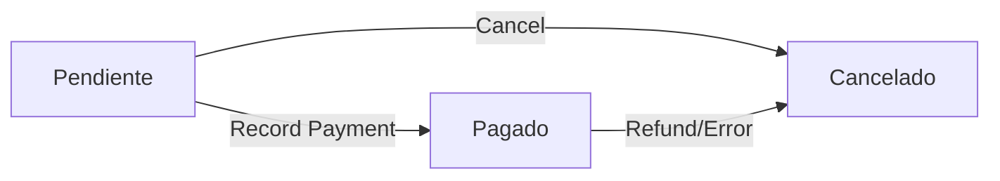

# Pagos API

The **Pago** entity represents payments made for sales transactions. Payments track the amount paid, payment method, status, and are associated with specific sales (Venta).

## Entity Overview

Payments manage:
- Payment amounts and dates
- Payment methods (cash, transfer, etc.)
- Payment status (pending, paid, cancelled)
- Association with sales transactions
- Optional payment notes/observations

## Entity Schema

```typescript title="src/models/Pago.ts" lines
@Entity("pago")
export class Pago {
  @PrimaryGeneratedColumn()
  id_pago!: number;

  @Column({ type: "date" })
  fecha!: Date;

  @Column({ type: "decimal", precision: 10, scale: 2 })
  monto!: number;

  @Column({ nullable: true })
  observacion?: string;

  @ManyToOne(() => Venta, (x) => x.pagos)
  @JoinColumn({ name: "id_venta" })
  venta!: Venta;

  @ManyToOne(() => MetodoPago, (x) => x.pagos)
  @JoinColumn({ name: "id_metodo_pago" })
  metodoPago!: MetodoPago;

  @ManyToOne(() => EstadoPago, (x) => x.pagos)
  @JoinColumn({ name: "id_estado_pago" })
  estadoPago!: EstadoPago;
}
```

### Schema Fields

<ResponseField name="id_pago" type="number">
  Auto-generated primary key
</ResponseField>

<ResponseField name="fecha" type="Date">
  Payment date
</ResponseField>

<ResponseField name="monto" type="number">
  Payment amount (decimal with 2 decimal places)
</ResponseField>

<ResponseField name="observacion" type="string">
  Optional payment notes or observations
</ResponseField>

<ResponseField name="venta" type="Venta">
  Many-to-one relationship with Sale
</ResponseField>

<ResponseField name="metodoPago" type="MetodoPago">
  Many-to-one relationship with Payment Method
</ResponseField>

<ResponseField name="estadoPago" type="EstadoPago">
  Many-to-one relationship with Payment Status
</ResponseField>

## API Endpoints

### GET /api/pagos

List all payments with relations.

**Authentication**: Required (Admin or Empleado role)

**Request**:
```bash
curl -X GET https://api.example.com/api/pagos \
  -H "Authorization: Bearer YOUR_JWT_TOKEN"
```

**Response** (200):
```json
{
  "success": true,
  "data": [
    {
      "id_pago": 1,
      "fecha": "2024-06-15",
      "monto": 150.00,
      "observacion": "Pago inicial",
      "venta": {
        "id_venta": 10,
        "fecha": "2024-06-15",
        "total": 300.00
      },
      "metodoPago": {
        "id_metodo_pago": 1,
        "nombre": "Efectivo"
      },
      "estadoPago": {
        "id_estado_pago": 2,
        "nombre": "Pagado"
      }
    }
  ]
}
```

<Note>
The GET endpoint automatically loads venta, metodoPago, and estadoPago relations for complete payment information.
</Note>

### GET /api/pagos/:id

Get a specific payment by ID with all relations.

**Authentication**: Required (Admin or Empleado role)

**Request**:
```bash
curl -X GET https://api.example.com/api/pagos/1 \
  -H "Authorization: Bearer YOUR_JWT_TOKEN"
```

**Response** (200):
```json
{
  "success": true,
  "data": {
    "id_pago": 1,
    "fecha": "2024-06-15",
    "monto": 150.00,
    "observacion": "Pago inicial",
    "venta": {
      "id_venta": 10,
      "fecha": "2024-06-15",
      "total": 300.00
    },
    "metodoPago": {
      "id_metodo_pago": 1,
      "nombre": "Efectivo"
    },
    "estadoPago": {
      "id_estado_pago": 2,
      "nombre": "Pagado"
    }
  }
}
```

**Error Response** (404):
```json
{
  "success": false,
  "message": "Pago no encontrado"
}
```

### POST /api/pagos

Create a new payment record.

**Authentication**: Required (Admin or Empleado role)

**Request**:
```bash
curl -X POST https://api.example.com/api/pagos \
  -H "Content-Type: application/json" \
  -H "Authorization: Bearer YOUR_JWT_TOKEN" \
  -d '{
    "fecha": "2024-06-20",
    "monto": 150.00,
    "observacion": "Second payment installment",
    "id_venta": 10,
    "id_metodo_pago": 1,
    "id_estado_pago": 2
  }'
```

**Request Body**:

<ParamField path="fecha" type="string" required>
  Payment date in YYYY-MM-DD format
</ParamField>

<ParamField path="monto" type="number" required>
  Payment amount (e.g., 150.00)
</ParamField>

<ParamField path="observacion" type="string">
  Optional payment notes or observations
</ParamField>

<ParamField path="id_venta" type="number">
  ID of the associated sale (Venta)
</ParamField>

<ParamField path="id_metodo_pago" type="number">
  ID of the payment method (1=Efectivo, 2=Transferencia, etc.)
</ParamField>

<ParamField path="id_estado_pago" type="number">
  ID of the payment status (1=Pendiente, 2=Pagado, 3=Cancelado)
</ParamField>

**Response** (201):
```json
{
  "success": true,
  "message": "Pago creado exitosamente",
  "data": {
    "id_pago": 5,
    "fecha": "2024-06-20",
    "monto": 150.00,
    "observacion": "Second payment installment"
  }
}
```

**Error Responses**:

- **400 Bad Request** - Missing required fields
  ```json
  {
    "success": false,
    "message": "Campos requeridos: fecha, monto"
  }
  ```

- **404 Not Found** - Invalid foreign key reference
  ```json
  {
    "success": false,
    "message": "Venta no encontrado"
  }
  ```

### PUT /api/pagos/:id

Update an existing payment.

**Authentication**: Required (Admin or Empleado role)

**Request**:
```bash
curl -X PUT https://api.example.com/api/pagos/1 \
  -H "Content-Type: application/json" \
  -H "Authorization: Bearer YOUR_JWT_TOKEN" \
  -d '{
    "monto": 175.00,
    "observacion": "Updated payment amount",
    "id_estado_pago": 2
  }'
```

**Request Body** (all fields optional):

<ParamField path="fecha" type="string">
  Updated payment date
</ParamField>

<ParamField path="monto" type="number">
  Updated payment amount
</ParamField>

<ParamField path="observacion" type="string">
  Updated notes
</ParamField>

<ParamField path="id_venta" type="number">
  Updated sale association
</ParamField>

<ParamField path="id_metodo_pago" type="number">
  Updated payment method
</ParamField>

<ParamField path="id_estado_pago" type="number">
  Updated payment status
</ParamField>

**Response** (200):
```json
{
  "success": true,
  "message": "Pago actualizado",
  "data": {
    "id_pago": 1,
    "fecha": "2024-06-15",
    "monto": 175.00,
    "observacion": "Updated payment amount"
  }
}
```

### DELETE /api/pagos/:id

Delete a payment record.

**Authentication**: Required (Admin or Empleado role)

<Warning>
Deleting payments removes the payment record permanently. Consider updating the estado_pago to "Cancelado" instead for audit purposes.
</Warning>

**Request**:
```bash
curl -X DELETE https://api.example.com/api/pagos/5 \
  -H "Authorization: Bearer YOUR_JWT_TOKEN"
```

**Response** (200):
```json
{
  "success": true,
  "message": "Pago eliminado"
}
```

## Common Use Cases

### Record a Cash Payment

```typescript
const pagoRepo = AppDataSource.getRepository(Pago);

const pago = pagoRepo.create({
  fecha: new Date(),
  monto: 200.00,
  observacion: "Full payment",
  venta: { id_venta: 15 },
  metodoPago: { id_metodo_pago: 1 }, // Efectivo
  estadoPago: { id_estado_pago: 2 }, // Pagado
});

await pagoRepo.save(pago);
```

### Calculate Total Paid for a Sale

```typescript
const pagoRepo = AppDataSource.getRepository(Pago);

const pagos = await pagoRepo.find({
  where: { 
    venta: { id_venta: 10 },
    estadoPago: { nombre: "Pagado" }
  },
});

const totalPaid = pagos.reduce((sum, pago) => sum + Number(pago.monto), 0);
console.log(`Total paid: $${totalPaid}`);
```

### Get Outstanding Balance

```typescript
const ventaRepo = AppDataSource.getRepository(Venta);
const pagoRepo = AppDataSource.getRepository(Pago);

const venta = await ventaRepo.findOne({ where: { id_venta: 10 } });
const pagos = await pagoRepo.find({
  where: { 
    venta: { id_venta: 10 },
    estadoPago: { nombre: "Pagado" }
  },
});

const totalPaid = pagos.reduce((sum, p) => sum + Number(p.monto), 0);
const balance = Number(venta.total) - totalPaid;

console.log(`Outstanding balance: $${balance}`);
```

### Revenue by Payment Method

```typescript
const pagoRepo = AppDataSource.getRepository(Pago);

const pagos = await pagoRepo.find({
  where: { estadoPago: { nombre: "Pagado" } },
  relations: ["metodoPago"],
});

const byMethod = pagos.reduce((acc, pago) => {
  const method = pago.metodoPago.nombre;
  acc[method] = (acc[method] || 0) + Number(pago.monto);
  return acc;
}, {} as Record<string, number>);

console.log("Revenue by method:", byMethod);
// { "Efectivo": 1250.00, "Transferencia": 2300.00 }
```

## Payment Status Workflow



## Best Practices

<CardGroup cols={2}>
  <Card title="Validate Amount" icon="calculator">
    Ensure payment amount doesn't exceed the outstanding sale balance
  </Card>
  <Card title="Track Partial Payments" icon="piggy-bank">
    Support installment plans by creating multiple payment records
  </Card>
  <Card title="Use Status Correctly" icon="list-check">
    Set status to "Pagado" only after payment verification
  </Card>
  <Card title="Add Observations" icon="note">
    Include payment details, references, or notes for audit trail
  </Card>
</CardGroup>

<Tip>
For refunds or payment corrections, create a new payment record with a negative amount rather than deleting the original payment.
</Tip>

## Next Steps

<CardGroup cols={2}>
  <Card title="Sales API" icon="shopping-cart" href="/api/ventas/overview">
    Learn about sales transactions
  </Card>
  <Card title="Payment Methods" icon="credit-card" href="/api/catalogs/metodos-pago">
    Configure payment methods
  </Card>
  <Card title="Payment Status" icon="list" href="/api/catalogs/estados">
    Understand payment status options
  </Card>
  <Card title="Revenue Reports" icon="chart-line" href="/concepts/architecture">
    Build financial reports
  </Card>
</CardGroup>