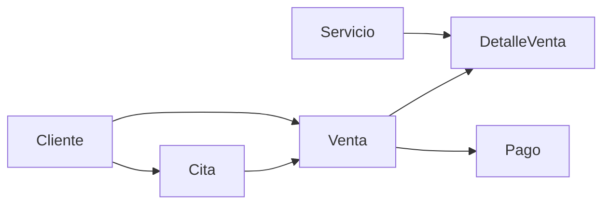

## Overview

The Ventas (Sales) API allows you to manage sales transactions in the Softwart system. Sales connect customers, appointments, services (through detail lines), and payments into complete transaction records.

## Entity Schema

### Venta Model

| Field | Type | Required | Description |
|-------|------|----------|-------------|
| `id_venta` | number | Auto | Primary key, auto-generated |
| `fecha` | date | Yes | Sale date (YYYY-MM-DD) |
| `total` | decimal(10,2) | Yes | Total sale amount |
| `observacion` | string | No | Additional notes or observations |
| `estado` | boolean | Yes | Active/inactive status (default: true) |
| `id_cita` | number | No | Foreign key to Cita (optional) |
| `id_cliente` | number | No | Foreign key to Cliente |

### Relationships

- **One-to-One with Cita**: A sale can be linked to one appointment (optional)
- **Many-to-One with Cliente**: Each sale belongs to one customer
- **One-to-Many with DetalleVenta**: A sale has multiple line items (services)
- **One-to-Many with Pago**: A sale can have multiple payments

<Info>
When fetching sales, related `cita` and `cliente` entities are automatically included in the response.
</Info>

<Note>
Deleting a sale is only allowed if there are no associated DetalleVenta or Pago records. The API will return a 409 Conflict error if dependencies exist.
</Note>

## Authentication

<Warning>
All Venta endpoints require authentication and role-based authorization.
</Warning>

**Required Roles**: `Admin` or `Empleado`

**Headers**:
```json
{
  "Authorization": "Bearer YOUR_JWT_TOKEN"
}
```

## Endpoints

### List All Sales

```http
GET /api/ventas
```

Retrieves all sales with related customer and appointment information.

**Response** (200 OK):
```json
{
  "success": true,
  "data": [
    {
      "id_venta": 1,
      "fecha": "2026-03-10",
      "total": 250.50,
      "observacion": "Cliente requiere entrega urgente",
      "estado": true,
      "cita": {
        "id_cita": 15,
        "fecha": "2026-03-10",
        "hora": "10:30:00"
      },
      "cliente": {
        "id_cliente": 5,
        "nombre": "Juan Pérez",
        "correo": "juan.perez@example.com",
        "telefono": "987654321"
      }
    }
  ]
}
```

### Get Sale by ID

```http
GET /api/ventas/:id
```

Retrieves a specific sale by its ID with related entities.

**Parameters**:
- `id` (path parameter): Sale ID

**Response** (200 OK):
```json
{
  "success": true,
  "data": {
    "id_venta": 1,
    "fecha": "2026-03-10",
    "total": 250.50,
    "observacion": "Cliente requiere entrega urgente",
    "estado": true,
    "cita": {
      "id_cita": 15,
      "fecha": "2026-03-10",
      "hora": "10:30:00",
      "estadoCita": {
        "id_estado_cita": 2,
        "nombre": "Completada"
      }
    },
    "cliente": {
      "id_cliente": 5,
      "nombre": "Juan Pérez",
      "documento": "12345678",
      "correo": "juan.perez@example.com",
      "telefono": "987654321"
    }
  }
}
```

**Error Response** (404 Not Found):
```json
{
  "success": false,
  "message": "Venta no encontrado"
}
```

### Create Sale

```http
POST /api/ventas
```

Creates a new sale transaction.

**Request Body**:
```json
{
  "fecha": "2026-03-10",
  "total": 250.50,
  "observacion": "Cliente requiere entrega urgente",
  "estado": true,
  "id_cita": 15,
  "id_cliente": 5
}
```

**Required Fields**: `fecha`, `total`

**Optional Fields**: `observacion`, `estado` (defaults to `true`), `id_cita`, `id_cliente`

**Response** (201 Created):
```json
{
  "success": true,
  "message": "Venta creado exitosamente",
  "data": {
    "id_venta": 1,
    "fecha": "2026-03-10",
    "total": 250.50,
    "observacion": "Cliente requiere entrega urgente",
    "estado": true,
    "cita": {
      "id_cita": 15,
      "fecha": "2026-03-10",
      "hora": "10:30:00"
    },
    "cliente": {
      "id_cliente": 5,
      "nombre": "Juan Pérez"
    }
  }
}
```

**Error Response** (400 Bad Request):
```json
{
  "success": false,
  "message": "Campos requeridos: fecha, total"
}
```

**Error Response** (404 Not Found - Invalid Relations):
```json
{
  "success": false,
  "message": "Cita no encontrado"
}
```
```json
{
  "success": false,
  "message": "Cliente no encontrado"
}
```

### Update Sale

```http
PUT /api/ventas/:id
```

Updates an existing sale. Only provided fields will be updated.

**Parameters**:
- `id` (path parameter): Sale ID

**Request Body** (all fields optional):
```json
{
  "fecha": "2026-03-11",
  "total": 300.00,
  "observacion": "Agregado servicio adicional",
  "id_cita": 15,
  "id_cliente": 5
}
```

<Warning>
When updating the `total` field, ensure it matches the sum of all associated DetalleVenta records for consistency.
</Warning>

**Response** (200 OK):
```json
{
  "success": true,
  "message": "Venta actualizado",
  "data": {
    "id_venta": 1,
    "fecha": "2026-03-11",
    "total": 300.00,
    "observacion": "Agregado servicio adicional",
    "estado": true,
    "cita": {
      "id_cita": 15,
      "fecha": "2026-03-10",
      "hora": "10:30:00"
    },
    "cliente": {
      "id_cliente": 5,
      "nombre": "Juan Pérez"
    }
  }
}
```

### Delete Sale

```http
DELETE /api/ventas/:id
```

Deletes a sale. Only allowed if there are no associated detail lines or payments.

**Parameters**:
- `id` (path parameter): Sale ID

**Response** (200 OK):
```json
{
  "success": true,
  "message": "Venta eliminado correctamente"
}
```

**Error Response** (409 Conflict):
```json
{
  "success": false,
  "message": "No se puede eliminar: existen DetalleVenta asociados (3)"
}
```
```json
{
  "success": false,
  "message": "No se puede eliminar: existen Pago asociados (2)"
}
```

### Toggle Sale Status

```http
PATCH /api/ventas/:id/estado
```

Toggles the sale's active/inactive status.

**Parameters**:
- `id` (path parameter): Sale ID

**Response** (200 OK):
```json
{
  "success": true,
  "message": "Venta activado",
  "data": {
    "estado": true
  }
}
```

## Usage Examples

### Creating a Complete Sale

```javascript
// Step 1: Create the sale
const saleResponse = await fetch('https://api.softwart.com/api/ventas', {
  method: 'POST',
  headers: {
    'Authorization': `Bearer ${token}`,
    'Content-Type': 'application/json'
  },
  body: JSON.stringify({
    fecha: '2026-03-10',
    total: 450.00,
    id_cliente: 5,
    id_cita: 15,
    observacion: 'Venta con múltiples servicios'
  })
});

const saleResult = await saleResponse.json();
const ventaId = saleResult.data.id_venta;

// Step 2: Add service details (see DetalleVenta API)
// Step 3: Add payments (see Pago API)
```

### Fetching Sales by Date Range

```javascript
const getSalesByDateRange = async (startDate, endDate) => {
  const response = await fetch('https://api.softwart.com/api/ventas', {
    headers: {
      'Authorization': `Bearer ${token}`
    }
  });
  
  const result = await response.json();
  if (result.success) {
    return result.data.filter(venta => {
      const fecha = new Date(venta.fecha);
      return fecha >= new Date(startDate) && fecha <= new Date(endDate);
    });
  }
  return [];
};

// Usage
const marchSales = await getSalesByDateRange('2026-03-01', '2026-03-31');
console.log(`March sales: ${marchSales.length}`);
```

### Calculating Total Revenue

```javascript
const getTotalRevenue = async () => {
  const response = await fetch('https://api.softwart.com/api/ventas', {
    headers: {
      'Authorization': `Bearer ${token}`
    }
  });
  
  const result = await response.json();
  if (result.success) {
    const activeSales = result.data.filter(venta => venta.estado);
    const total = activeSales.reduce((sum, venta) => sum + parseFloat(venta.total), 0);
    return total.toFixed(2);
  }
  return 0;
};

console.log(`Total revenue: $${await getTotalRevenue()}`);
```

### Finding Sales Without Appointments

```javascript
const response = await fetch('https://api.softwart.com/api/ventas', {
  headers: {
    'Authorization': `Bearer ${token}`
  }
});

const result = await response.json();
if (result.success) {
  const walkInSales = result.data.filter(venta => !venta.cita);
  console.log('Walk-in sales:', walkInSales.length);
}
```

### Updating Sale Total

```bash
curl -X PUT https://api.softwart.com/api/ventas/1 \
  -H "Authorization: Bearer YOUR_JWT_TOKEN" \
  -H "Content-Type: application/json" \
  -d '{
    "total": 550.00,
    "observacion": "Precio actualizado por descuento aplicado"
  }'
```

## Sale Workflow

A typical sale workflow involves multiple entities:

1. **Customer** creates or exists in the system
2. **Appointment** (optional) is scheduled
3. **Sale** record is created with customer and appointment references
4. **DetalleVenta** records are added for each service
5. **Payments** are recorded against the sale



<Tip>
Use the [DetalleVenta API](/api/ventas/detalle-venta) to manage individual service line items and the [Pago API](/api/pagos/overview) to track payments.
</Tip>

## Related Entities

### DetalleVenta (Sale Details)

Each sale can have multiple detail lines that specify:
- Which service was provided
- Service price
- Service status
- Associated frame (marco) if applicable
- Date and observations

### Pago (Payments)

Sales can have multiple payments to support:
- Partial payments
- Multiple payment methods
- Payment installments
- Down payments and final payments

## Error Responses

All endpoints may return the following error responses:

| Status Code | Description |
|-------------|-------------|
| 400 | Bad Request - Missing required fields |
| 401 | Unauthorized - Missing or invalid token |
| 403 | Forbidden - Insufficient permissions |
| 404 | Not Found - Sale or related entity doesn't exist |
| 409 | Conflict - Cannot delete due to dependencies |
| 500 | Internal Server Error |

**Generic Error Format**:
```json
{
  "success": false,
  "message": "Error description",
  "error": {} // Additional error details (dev mode only)
}
```