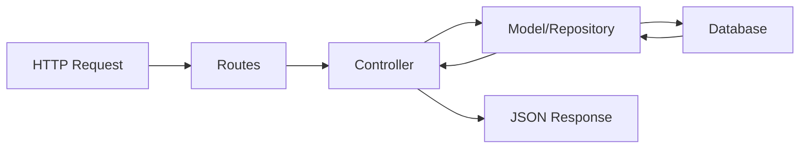

# MVC Structure

Softwart Backend implements the **Model-View-Controller (MVC)** architectural pattern, separating concerns into three distinct layers. In a REST API context, the "View" is represented by JSON responses rather than HTML templates.

## MVC Components



## Models (Data Layer)

Models are TypeORM entities that represent database tables and define the data structure.

### Entity Definition

Models are TypeScript classes decorated with TypeORM decorators:

```typescript title="src/models/Usuario.ts" lines
import { Column, Entity, JoinColumn, ManyToOne, PrimaryGeneratedColumn } from "typeorm";
import { Rol } from "./Rol";

@Entity("usuario")
export class Usuario {
  @PrimaryGeneratedColumn()
  id_usuario!: number;

  @Column({ unique: true })
  correo!: string;

  @Column()
  clave!: string;

  @Column({ type: "boolean" })
  estado!: boolean;

  @ManyToOne(() => Rol, (x) => x.usuarios)
  @JoinColumn({ name: "id_rol" })
  rol!: Rol;
}
```

### Model Responsibilities

<CardGroup cols={2}>
  <Card title="Data Structure" icon="table">
    Define table schema with column types and constraints
  </Card>
  <Card title="Relationships" icon="link">
    Declare foreign keys and entity relations
  </Card>
  <Card title="Validation" icon="check-circle">
    Enforce database-level constraints (unique, not null)
  </Card>
  <Card title="Type Safety" icon="shield-check">
    Provide TypeScript interfaces for data access
  </Card>
</CardGroup>

### Common Model Patterns

**Primary Key**:
```typescript
@PrimaryGeneratedColumn()
id_usuario!: number;
```

**Unique Constraint**:
```typescript
@Column({ unique: true })
correo!: string;
```

**Boolean Type**:
```typescript
@Column({ type: "boolean" })
estado!: boolean;
```

**Many-to-One Relationship**:
```typescript
@ManyToOne(() => Rol, (x) => x.usuarios)
@JoinColumn({ name: "id_rol" })
rol!: Rol;
```

**One-to-Many Relationship**:
```typescript
@OneToMany(() => Cita, (x) => x.cliente)
citas!: Cita[];
```

## Controllers (Business Logic Layer)

Controllers handle HTTP requests, execute business logic, and return responses.

### Controller Structure

Each controller exports async functions that handle specific routes:

```typescript title="src/controllers/UsuarioController.ts" lines
import { Request, Response } from "express";
import { AppDataSource } from "../data-source";
import { Usuario } from "../models/Usuario";
import bcrypt from "bcrypt";

const usuarioRepo = AppDataSource.getRepository(Usuario);

// Helper to remove sensitive fields
function sinClave(usuario: Usuario) {
  const { clave, ...resto } = usuario;
  return resto;
}

// GET /api/usuarios - List all users
export const getAllUsuario = async (_req: Request, res: Response): Promise<void> => {
  try {
    const usuarios = await usuarioRepo.find({ relations: ["rol"] });
    res.json({ success: true, data: usuarios.map(sinClave) });
  } catch (error) {
    res.status(500).json({ success: false, message: "Error al obtener usuarios", error });
  }
};

// GET /api/usuarios/:id - Get user by ID
export const getUsuarioById = async (req: Request, res: Response): Promise<void> => {
  try {
    const usuario = await usuarioRepo.findOne({
      where: { id_usuario: Number(req.params.id) },
      relations: ["rol"],
    });

    if (!usuario) {
      res.status(404).json({ success: false, message: "Usuario no encontrado" });
      return;
    }

    res.json({ success: true, data: sinClave(usuario) });
  } catch (error) {
    res.status(500).json({ success: false, message: "Error al obtener usuario", error });
  }
};

// POST /api/usuarios - Create user
export const createUsuario = async (req: Request, res: Response): Promise<void> => {
  try {
    const { correo, clave, id_rol } = req.body;

    // Validate required fields
    if (!correo || !clave || !id_rol) {
      res.status(400).json({ success: false, message: "Campos requeridos: correo, clave, id_rol" });
      return;
    }

    // Check for duplicate email
    const existe = await usuarioRepo.findOne({ where: { correo } });
    if (existe) {
      res.status(409).json({ success: false, message: "El correo ya está registrado" });
      return;
    }

    // Hash password
    const hashedClave = await bcrypt.hash(clave, 10);

    // Create and save user
    const nuevoUsuario = usuarioRepo.create({
      correo,
      clave: hashedClave,
      estado: true,
      rol: { id_rol },
    });

    await usuarioRepo.save(nuevoUsuario);
    res.status(201).json({ success: true, data: sinClave(nuevoUsuario) });
  } catch (error) {
    res.status(500).json({ success: false, message: "Error al crear usuario", error });
  }
};
```

### Controller Responsibilities

<Steps>
  <Step title="Request Validation">
    Validate required fields, data types, and constraints
    ```typescript
    if (!correo || !clave) {
      res.status(400).json({ success: false, message: "Campos requeridos" });
      return;
    }
    ```
  </Step>
  
  <Step title="Business Logic">
    Execute business rules (password hashing, duplicate checks, calculations)
    ```typescript
    const hashedClave = await bcrypt.hash(clave, 10);
    ```
  </Step>
  
  <Step title="Database Operations">
    Use TypeORM repositories to query and modify data
    ```typescript
    const usuario = await usuarioRepo.findOne({ where: { id_usuario: id } });
    ```
  </Step>
  
  <Step title="Response Formatting">
    Return consistent JSON responses with status codes
    ```typescript
    res.status(201).json({ success: true, data: nuevoUsuario });
    ```
  </Step>
</Steps>

### Standard Response Format

All controllers follow a consistent response structure:

**Success Response**:
```json
{
  "success": true,
  "data": { /* ... */ }
}
```

**Error Response**:
```json
{
  "success": false,
  "message": "Error message",
  "error": { /* optional error details */ }
}
```

## Routes (Request Routing Layer)

Routes map HTTP methods and URL patterns to controller functions.

### Route Definition

```typescript title="src/routes/UsuarioRoutes.ts" lines
import { Router } from "express";
import {
  getAllUsuario,
  getUsuarioById,
  createUsuario,
  updateUsuario,
  deleteUsuario,
  toggleEstadoUsuario,
} from "../controllers/UsuarioController";
import { verifyToken, requireRol } from "../middlewares/auth.middleware";

export const usuarioRouter = Router();

// All routes require authentication and Admin role
usuarioRouter.use(verifyToken, requireRol("Admin"));

// CRUD endpoints
usuarioRouter.get("/", getAllUsuario);
usuarioRouter.get("/:id", getUsuarioById);
usuarioRouter.post("/", createUsuario);
usuarioRouter.put("/:id", updateUsuario);
usuarioRouter.delete("/:id", deleteUsuario);
usuarioRouter.patch("/:id/toggle-estado", toggleEstadoUsuario);
```

### Route Registration

All routers are registered centrally in `routes/index.ts`:

```typescript title="src/routes/index.ts" lines
import { Application } from "express";
import { usuarioRouter } from "./UsuarioRoutes";
import { clienteRouter } from "./ClienteRoutes";
import { citaRouter } from "./CitaRoutes";
// ... other imports

export function registerRoutes(app: Application): void {
  app.use("/api/usuarios", usuarioRouter);
  app.use("/api/clientes", clienteRouter);
  app.use("/api/citas", citaRouter);
  // ... other routes
}
```

### Route Responsibilities

<CardGroup cols={2}>
  <Card title="URL Mapping" icon="route">
    Define RESTful URL patterns for resources
  </Card>
  <Card title="HTTP Methods" icon="list">
    Map GET, POST, PUT, DELETE, PATCH to controllers
  </Card>
  <Card title="Middleware Chain" icon="link">
    Apply authentication and authorization middleware
  </Card>
  <Card title="Parameter Extraction" icon="hashtag">
    Extract URL parameters, query strings, and body
  </Card>
</CardGroup>

## RESTful Conventions

Softwart Backend follows standard REST conventions:

| HTTP Method | URL Pattern | Controller Function | Purpose |
|-------------|-------------|---------------------|----------|
| `GET` | `/api/usuarios` | `getAllUsuario` | List all users |
| `GET` | `/api/usuarios/:id` | `getUsuarioById` | Get single user |
| `POST` | `/api/usuarios` | `createUsuario` | Create new user |
| `PUT` | `/api/usuarios/:id` | `updateUsuario` | Update user |
| `DELETE` | `/api/usuarios/:id` | `deleteUsuario` | Delete user |
| `PATCH` | `/api/usuarios/:id/toggle-estado` | `toggleEstadoUsuario` | Toggle user status |

## MVC Flow Example

Let's trace a complete request through the MVC layers:

<Steps>
  <Step title="Client Request">
    ```bash
    POST /api/usuarios
    Content-Type: application/json
    Authorization: Bearer eyJhbGci...

    {
      "correo": "new@example.com",
      "clave": "password123",
      "id_rol": 2
    }
    ```
  </Step>
  
  <Step title="Route Matching">
    Express matches the route in `UsuarioRoutes.ts`:
    ```typescript
    usuarioRouter.post("/", createUsuario);
    ```
    Middleware chain executes:
    1. `verifyToken` - Validates JWT
    2. `requireRol("Admin")` - Checks role
  </Step>
  
  <Step title="Controller Execution">
    `createUsuario` in `UsuarioController.ts` runs:
    1. Validates required fields
    2. Checks for duplicate email
    3. Hashes password with bcrypt
    4. Creates Usuario entity
    5. Saves to database via repository
  </Step>
  
  <Step title="Model Interaction">
    TypeORM uses the `Usuario` model:
    1. Maps TypeScript object to SQL
    2. Inserts row into `usuario` table
    3. Returns created entity with generated ID
  </Step>
  
  <Step title="Response">
    ```json
    HTTP/1.1 201 Created
    Content-Type: application/json

    {
      "success": true,
      "data": {
        "id_usuario": 123,
        "correo": "new@example.com",
        "estado": true,
        "rol": { "id_rol": 2 }
      }
    }
    ```
  </Step>
</Steps>

## Best Practices

<Accordion title="Keep Controllers Thin">
Controllers should coordinate between layers, not contain complex business logic. Extract complex logic into service classes if needed.

```typescript
// ❌ Bad - Complex logic in controller
export const calculateRevenue = async (req: Request, res: Response) => {
  // 50 lines of calculation logic...
};

// ✅ Good - Logic in service class
import { RevenueService } from "../services/RevenueService";

export const calculateRevenue = async (req: Request, res: Response) => {
  const revenue = await RevenueService.calculate(req.params.startDate, req.params.endDate);
  res.json({ success: true, data: revenue });
};
```
</Accordion>

<Accordion title="Use TypeORM Relations Wisely">
Load relations only when needed to avoid N+1 query problems.

```typescript
// Load with relations
const usuario = await usuarioRepo.findOne({
  where: { id_usuario: id },
  relations: ["rol"], // Explicitly load rol relation
});
```
</Accordion>

<Accordion title="Validate Input Early">
Validate all input parameters before executing business logic.

```typescript
if (!correo || !clave || !id_rol) {
  res.status(400).json({ success: false, message: "Campos requeridos" });
  return;
}
```
</Accordion>

<Accordion title="Handle Errors Consistently">
Use try-catch blocks and return consistent error responses.

```typescript
try {
  // Business logic
} catch (error) {
  res.status(500).json({ success: false, message: "Error", error });
}
```
</Accordion>

## Next Steps

<CardGroup cols={2}>
  <Card title="TypeORM Integration" icon="database" href="/concepts/typeorm-integration">
    Learn about entities, repositories, and relations
  </Card>
  <Card title="Generated Models" icon="table" href="/generated/models">
    Explore auto-generated model patterns
  </Card>
  <Card title="Generated Controllers" icon="code" href="/generated/controllers">
    See controller generation patterns
  </Card>
  <Card title="Generated Routes" icon="route" href="/generated/routes">
    Understand route generation
  </Card>
</CardGroup>